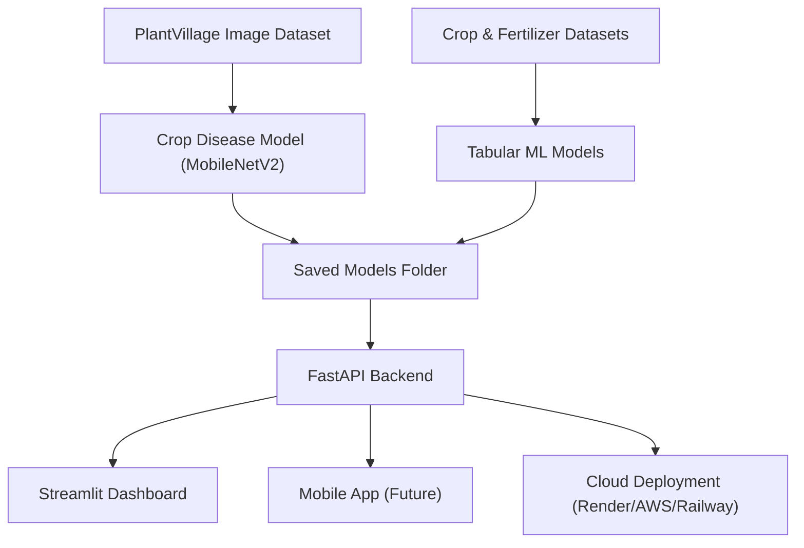

Here is your **complete, final README.md** with:

✅ A **beautiful banner header** (pure Markdown – works on GitHub)
✅ A **professional architecture diagram** (Mermaid)
✅ Fully formatted, clean, and ready to paste
👉 **Just copy → paste → save.**

---

# 🌾 **CropAI – Intelligent Crop Disease Detection & Smart Recommendation System**

<p align="center">
  
</p>


---

## 🏗️ **Project Architecture**



---

# 🧠 **Features**

---

## **1️⃣ Crop Disease Detection (Deep Learning)**

* Built using **MobileNetV2** (Transfer Learning)
* Trained on the **PlantVillage** dataset
* Detects crop disease from leaf image
* Returns:

  * Disease label
  * Confidence score

**API Endpoint:** `POST /predict-disease`

### **Output Example**

```json
{
  "predicted_class_index": 14,
  "disease_label": "Tomato___Early_blight",
  "confidence": 0.83
}
```

---

## **2️⃣ Crop Recommendation System**

* Inputs:

  * N, P, K
  * Temperature, Humidity
  * pH, Rainfall
* Predicts the best crop to grow

**API Endpoint:** `POST /recommend-crop`

```json
{
  "recommended_crop": "rice"
}
```

---

## **3️⃣ Fertilizer Recommendation System**

* Inputs:

  * Temperature, Humidity, Moisture
  * Soil Type, Crop Type
  * Nitrogen, Phosphorous, Potassium
* Predicts the best fertilizer

**API Endpoint:** `POST /recommend-fertilizer`

```json
{
  "recommended_fertilizer": "Urea"
}
```

---

# 🚀 **How to Run Locally**

### **1️⃣ Environment Setup**

```bash
conda create -n cropai python=3.10
conda activate cropai
pip install -r requirements.txt
```

---

### **2️⃣ Run Backend (FastAPI)**

```bash
cd backend
uvicorn main:app --reload --host 0.0.0.0 --port 8000
```

API Docs:
👉 [http://127.0.0.1:8000/docs](http://127.0.0.1:8000/docs)

---

### **3️⃣ Run Dashboard (Streamlit)**

```bash
cd dashboard
streamlit run app.py
```

Dashboard:
👉 [http://localhost:8501](http://localhost:8501)

---

# 📸 **Screenshots (Add Later)**

Create `/screenshots` and upload images.
Then embed like this:

```markdown


```

---

# 🎯 **Future Enhancements**

* Improve accuracy with heavy fine-tuning
* Add multilingual UI for farmers
* Build a mobile app (Flutter/React Native)
* Deploy backend + dashboard to Render/Railway/AWS
* Add real-time weather API integration
* Build farmer login + recommendation history

---

# 💼 **Why This Project Matters**

This project demonstrates:

* 🧠 Deep Learning (CV with MobileNetV2)
* 📊 Machine Learning (RandomForest, preprocessing)
* ⚙️ API engineering (FastAPI, Pydantic, CORS)
* 🖥️ Interactive dashboards (Streamlit)
* 🧩 Full end-to-end design (data → model → API → UI)
* 🧱 Production-ready architecture

Perfect for:

* Resume
* LinkedIn posts
* Interviews
* Final-year projects
* ML engineering portfolios

---

# 👤 **Author**

**Akhil Saurabh**

---

# ⭐ Final Step: Upload Banner Image

1. Go to your GitHub repo
2. Click **Add file → Upload file**
3. Upload your banner image (PNG/JPG) into the repository
4. Click the image → copy its URL
5. Replace this line:

```markdown

```

with:

```markdown

```

Done 💥

---

If you'd like, I can also:

✅ Create a professional banner image for you
✅ Add badges (Python version, FastAPI, TensorFlow, license, stars)
✅ Style the README even more professionally
Just tell me!
